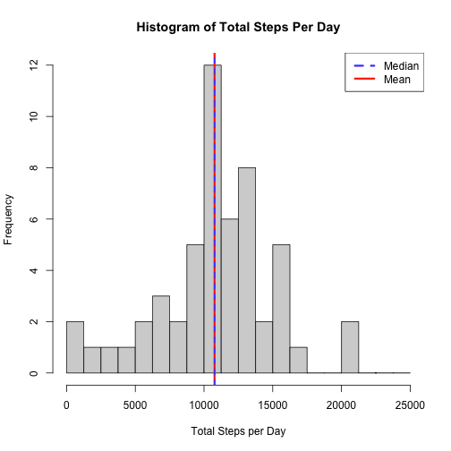
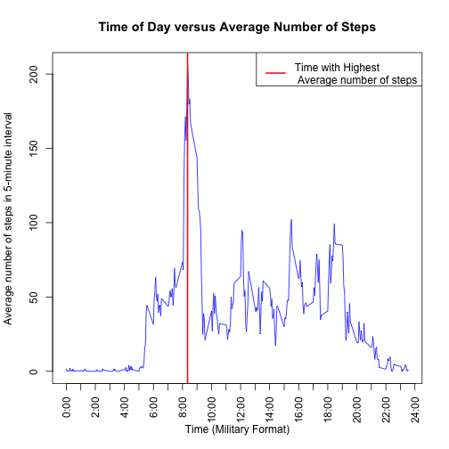
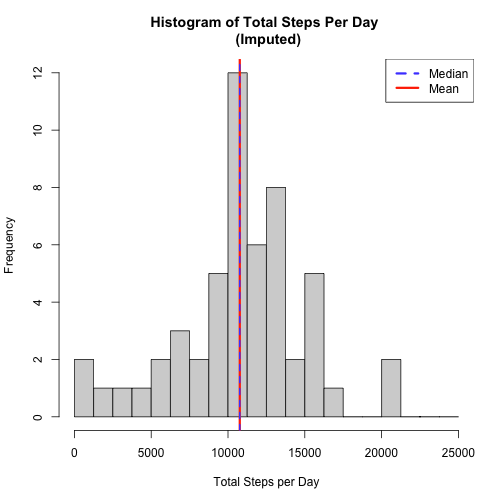
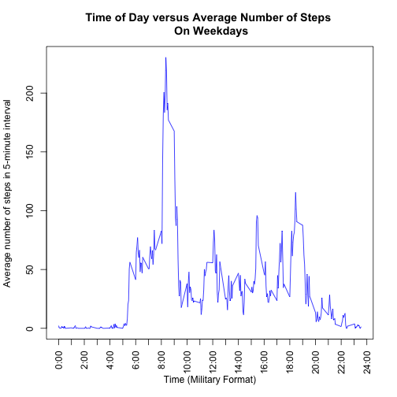
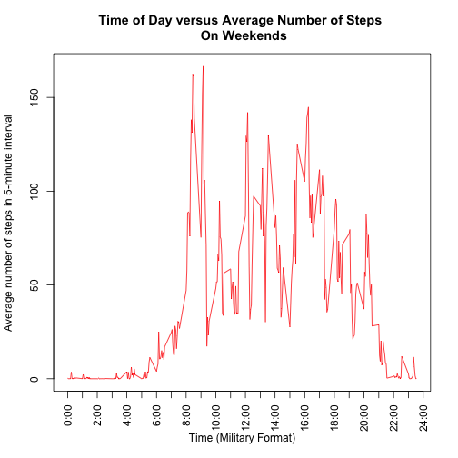

Reproducable Research: Project 1

===
# Loading in the data

Loading the data is pretty simple using the `read.csv()` command below.


```r
stepsdata = read.csv('activity.csv')
```

# What is the mean number of steps taken per day?

By using the `na.rm` argument for the `mean` command, we can compute the mean easily:


```r
#first we make an index of all the data entries that are 'NA'
ismissing = is.na(stepsdata$steps)

#then the aggregate function will give us the totals by date for us to average.
dayssummed = aggregate(stepsdata$steps[!ismissing], list(stepsdata$date[!ismissing]), sum, na.rm = TRUE)

#Now laslty we can make our histogram:

hist(dayssummed$x, seq(0,25000, 1250),
     #and of course we have to make it pretty
     main = "Histogram of Total Steps Per Day",
     xlab = "Total Steps per Day")

#now let's calculate our median and mean:
mean(dayssummed$x)
```

```
## [1] 10766.19
```

```r
median(dayssummed$x)
```

```
## [1] 10765
```

```r
#now I add mean and median lines to the graph so that we can see visually where they lie
abline(v = mean(dayssummed$x), col = rgb(1, .2, 0, 1), lwd = 3)
abline(v = median(dayssummed$x), col = rgb(.3, .3, 1, 1), lwd = 2 , lty = 8)
legend( 'topright', c("Median", "Mean"), lty = c(8, 1), lwd = c(3,3), col = c(rgb(.3, .3, 1, 1), rgb(1, .2, 0, 1)))
```



As you can see, our mean of NA steps per day is nearly equal to the data's median at NA steps per day.

# What is the average daily activity pattern?

To find out what 5-minute interval has the highest average amount of steps, we will need to aggregate our data by the interval, instead of by the day like the above code chunk.


```r
# calculating the mean with the missing values becomes trivial by using the "na.rm" parameter
intervalmeans = aggregate(stepsdata$steps, list(stepsdata$interval), mean, na.rm = TRUE)

#labels for the X axis
xlabels = rep("", 25)

for (num in seq(0, 24, 2)) {
  xlabels[num+1] = paste(num, ':00', sep = '') 
}

#get maximum value interval
maxinterval = intervalmeans$Group.1[intervalmeans$x == max(intervalmeans$x)]

#the plot
plot(unique(stepsdata$interval), intervalmeans$x, type = 'l', xaxp = c(0, 2400, 25), xaxt = 'n', xlab = "Time (Military Format)", main = "Time of Day versus Average Number of Steps", ylab = "Average number of steps in 5-minute interval", col = 'blue')
abline(v = intervalmeans$Group.1[intervalmeans$x == max(intervalmeans$x)], lwd = 2, col = 'red')
#the plot beauty salon
axis(1, at = seq(0, 2400, 100), labels = xlabels, las = 2)
legend('topright', 'Time with Highest \n Average number of steps', col = 'red' ,lwd = 2)
```



As seen on the above plot, we can see that the time with the highest average number of steps is 8:35.

#Imputing Missing Values

To impute the missing values, I've decided to replace the missing values with the average number of steps for the time interval of the missing value. This way, the values added to the set of data for any given day will be representative of a typical number of steps for that time in the day. If I wanted to make this more complicated, I would use the average number of steps for that interval, but split it into weekend and weekday groups since we eventually want to compare the differences between these groups. If I wanted to make this *really* complicated I would do a test to compare the means between thee weekend and weekday groups and choose whether to use this subdivision depending on the outcome. Let's not make this complicated and just use the general mean for the interval however. To do this, I use the code below:


```r
#first, make a copy so we aren't editting the original data and prepare the dataframe.
impstepsdata = stepsdata
impstepsintmeans = aggregate(impstepsdata$steps, list(impstepsdata$interval), mean, na.rm = TRUE)
colnames(impstepsintmeans) = c('interval', 'avsteps')

#now we impute the data by operating on the Nas
for (i in 1:length(impstepsdata$steps)) {
  if (is.na(impstepsdata$steps[i])) {
    intvl = impstepsdata$interval[i] 
    impstepsdata$steps[i] = impstepsintmeans$avsteps[impstepsintmeans$interval == intvl]
  }
}

#then the aggregate function will give us the totals by date for us to average.
impdayssummed = aggregate(stepsdata$steps, list(impstepsdata$date), sum)

#Now laslty we can make our histogram:

hist(dayssummed$x, seq(0,25000, 1250),
     #and of course we have to make it pretty
     main = "Histogram of Total Steps Per Day \n (Imputed)",
     xlab = "Total Steps per Day")

#now let's calculate our median and mean:
mean(impdayssummed$x)
```

```
## [1] NA
```

```r
median(impdayssummed$x)
```

```
## [1] NA
```

```r
#now I add mean and median lines to the graph so that we can see visually where they lie
abline(v = mean(dayssummed$x), col = rgb(1, .2, 0, 1), lwd = 3)
abline(v = median(dayssummed$x), col = rgb(.3, .3, 1, 1), lwd = 2 , lty = 8)
legend( 'topright', c("Median", "Mean"), lty = c(8, 1), lwd = c(3,3), col = c(rgb(.3, .3, 1, 1), rgb(1, .2, 0, 1)))
```




I've repeated the initial histogram below the new one for comparison. We see that there is basically no difference herem with the only real difference in the statistics being that the median of the imputed data is exactly equal to the means of both the imputed and unimputed data, being slightly higher than the median of the initial data. Given the scale of the data, this difference is negligable. So between the imputed data and the unimputed data there is no. meaningful difference.

#Are there differences in activity patterns between weekdays and weekends?

Using the `weekdays()` function we can create a factor that denotes weekdays with a `0` and weekend days with a `1`.


```r
impstepsdatawknd = cbind(impstepsdata, weekend = (weekdays((as.Date(impstepsdata$date))) == "Saturday") | ((weekdays((as.Date(impstepsdata$date))) == "Sunday")))

impavstepsweek = aggregate(impstepsdatawknd[impstepsdatawknd$weekend == FALSE, c('steps', 'interval')], list(impstepsdatawknd$interval[impstepsdatawknd$weekend == FALSE]), mean)

impavstepswknd = aggregate(impstepsdatawknd[impstepsdatawknd$weekend == TRUE, c('steps', 'interval')], list(impstepsdatawknd$interval[impstepsdatawknd$weekend == TRUE]), mean)


plot(impavstepsweek$interval, impavstepsweek$steps, type = 'l', xaxp = c(0, 2400, 25), xaxt = 'n', xlab = "Time (Military Format)", main = "Time of Day versus Average Number of Steps \n On Weekdays", ylab = "Average number of steps in 5-minute interval", col = 'blue')
#the plot beauty salon
axis(1, at = seq(0, 2400, 100), labels = xlabels, las = 2)
```




```r
plot(impavstepswknd$interval, impavstepswknd$steps, type = 'l', xaxp = c(0, 2400, 25), xaxt = 'n', xlab = "Time (Military Format)", main = "Time of Day versus Average Number of Steps \n On Weekends", ylab = "Average number of steps in 5-minute interval", col = 'red')
#the plot beauty salon
axis(1, at = seq(0, 2400, 100), labels = xlabels, las = 2)
```



So as we can see from the graphs above, on the weekends our anonymous walker doesn't walk as much at one time, but tends to walk more throughout the day.s
